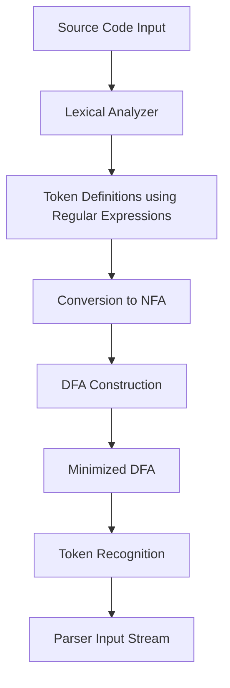

## Regular Expressions in Modern Compilers and Programming Languages

### *A Self-Learning Exploration through NPTEL Course on Theory of Computation*

---

### **1. Introduction**

Regular Expressions (Regex) are among the most elegant mathematical tools in computer science. They serve as the foundation for describing and processing patterns within strings—an essential task in programming languages, text editors, and especially in compiler design.

Originally rooted in **formal language theory** and **finite automata**, regular expressions define **regular languages**, which can be recognized by **deterministic or non-deterministic finite automata (DFA/NFA)**.

Through my **self-learning via the NPTEL course on “Theory of Computation”**, I gained insight into how regex serves as the practical bridge between theoretical computation and modern software tools. In this article, we explore the mathematical concepts, working principles, and real-world applications of regular expressions, emphasizing their vital role in compilers and programming languages.

---

### **2. Conceptual Foundations**

In the **theory of computation**, a *regular expression* is a symbolic notation used to describe a *regular language*.
Mathematically, it is defined using three basic operations:

* **Union ( ∪ )** → Represents choice.
  Example: `(a ∪ b)` represents strings containing either 'a' or 'b'.
* **Concatenation (·)** → Represents sequence.
  Example: `ab` means ‘a’ followed by ‘b’.
* **Kleene Star ( * )** → Represents repetition.
  Example: `a*` means zero or more occurrences of ‘a’.

Formally, every regular expression can be converted into a **finite automaton** and vice versa. This property establishes the computational equivalence between *regex* and *finite automata*.

---

### **3. Regular Expressions in Compiler Design**

One of the earliest and most critical applications of regular expressions is in **lexical analysis**, the first stage of a compiler. The lexical analyzer (lexer or scanner) reads the input source code and converts it into a sequence of **tokens** (keywords, identifiers, constants, etc.).

Each token is defined by a **regular expression**. For example:

| Token Type | Regular Expression       |      |       |     |         |
| ---------- | ------------------------ | ---- | ----- | --- | ------- |
| Identifier | `[a-zA-Z_][a-zA-Z0-9_]*` |      |       |     |         |
| Number     | `[0-9]+(\.[0-9]+)?`      |      |       |     |         |
| Keyword    | `if                      | else | while | for | return` |
| Operator   | `[+\-*/=<>!]`            |      |       |     |         |

The **lexical analyzer generator**, such as **Lex** or **Flex**, takes these regex definitions and automatically produces code that implements the tokenization process. Internally, these tools translate regex into **finite automata**, which efficiently recognize tokens in a single scan.

---

### **4. Working Process of Regex in Compilers**

Below is a conceptual flowchart representing how regular expressions are used during **lexical analysis** in compiler design.



This process ensures that each token in the source program is matched accurately, enabling smooth transition to **syntax analysis (parsing)**.

---

### **5. Implementation in Modern Programming Languages**

Modern programming languages like **Python, JavaScript, C++, and Java** include built-in support for regular expressions. Though used primarily for **pattern matching** and **text processing**, the underlying mechanism mirrors compiler lexing.

#### **Example – Regex in Python**

```python
import re

pattern = r"[A-Za-z_]\w*"
source = "int count = 10;"
matches = re.findall(pattern, source)
print(matches)  # Output: ['int', 'count']
```

This Python snippet demonstrates how regular expressions mimic the lexical analysis step, identifying identifiers (`int`, `count`) from the source string.

#### **In Java:**

```java
import java.util.regex.*;

class RegexExample {
    public static void main(String[] args) {
        Pattern p = Pattern.compile("[A-Za-z_][A-Za-z0-9_]*");
        Matcher m = p.matcher("while(total>0){count++;}");
        while(m.find()) {
            System.out.println(m.group());
        }
    }
}
```

Languages like **Perl**, **JavaScript**, and **Rust** extend regex capabilities through powerful pattern engines, offering features like **lookaheads**, **backreferences**, and **named groups**, which go beyond classical regular languages.

---

### **6. Real-Life Applications**

Regular expressions are not confined to compilers—they are fundamental in various domains of computer science:

| Area                                  | Real-Life Use Case                                                         |
| ------------------------------------- | -------------------------------------------------------------------------- |
| **Text Processing**                   | Searching, validating, and formatting text in IDEs, editors, or logs.      |
| **Cybersecurity**                     | Detecting malicious URLs, phishing patterns, or suspicious log entries.    |
| **Data Analytics**                    | Cleaning and extracting structured information from unstructured datasets. |
| **Natural Language Processing (NLP)** | Tokenization and preprocessing of textual data.                            |
| **Web Development**                   | Form validation and server-side input sanitization.                        |

Thus, regex remains an essential tool in both theoretical foundations and real-world computing applications.

---

### **7. Importance in Computer Science**

1. **Bridging Theory and Practice**
   Regular expressions directly link **formal language theory** with practical software implementation.
2. **Foundation for Automata Theory**
   Regex forms the basis for designing finite automata, essential in the **theory of computation**.
3. **Automation of Compiler Stages**
   Enables automated construction of lexers using tools like **Lex/Flex**, saving manual effort.
4. **Efficiency and Optimization**
   The deterministic behavior of regex-based automata ensures fast, linear-time token recognition.
5. **Reusability and Modularity**
   Regex patterns can be modularly reused across projects, improving maintainability.

---

### **8. Reflections from NPTEL Self-Learning**

Completing the **NPTEL course on Theory of Computation** enhanced my understanding of how mathematical abstractions like *regular languages*, *finite automata*, and *grammars* power practical systems like compilers and interpreters.

The course highlighted how **regex engines are optimized DFA implementations**, and how these form the bridge between *theoretical computation models* and *real-world programming tools*.

---

### **9. Conclusion**

Regular expressions are not merely pattern-matching tools—they embody a deep theoretical concept from the theory of computation. Their role in compiler design, text processing, and programming languages demonstrates the timeless relevance of discrete structures in modern computing.

Through self-learning and hands-on exploration, I realized that understanding regex helps one appreciate the seamless blend of mathematical theory and engineering practice that defines computer science. From lexical analyzers in compilers to powerful data-driven applications, regular expressions remain the unsung heroes of efficient computation.

---

### **10. References**

1. Hopcroft, J.E., Motwani, R., & Ullman, J.D. (2007). *Introduction to Automata Theory, Languages, and Computation.* Pearson.
2. Aho, A.V., Lam, M.S., Sethi, R., & Ullman, J.D. (2006). *Compilers: Principles, Techniques, and Tools* (2nd ed.). Pearson.
3. NPTEL Course: *Theory of Computation* — Prof. Anil Kumar, IIT Madras.
4. Python Official Docs — [https://docs.python.org/3/library/re.html](https://docs.python.org/3/library/re.html)
5. Java Pattern API — [https://docs.oracle.com/javase/8/docs/api/java/util/regex/Pattern.html](https://docs.oracle.com/javase/8/docs/api/java/util/regex/Pattern.html)


