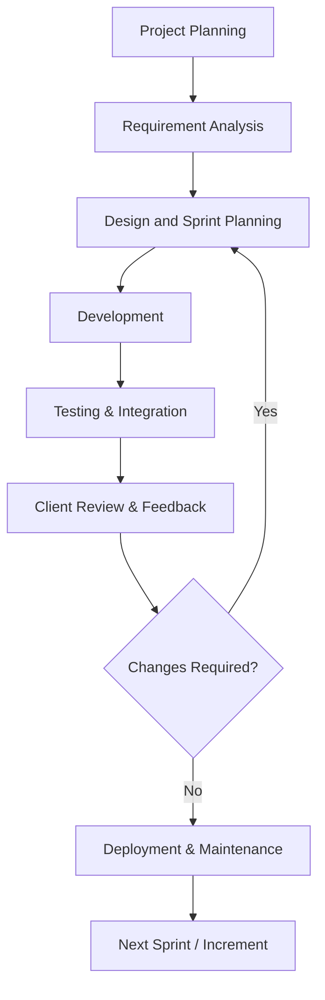

##  Agile Methodology in Software Engineering and Project Management

---

###  Introduction

In today’s fast-paced technological world, the demand for **efficient, adaptive, and customer-focused software development** has grown tremendously. Traditional methods like the Waterfall Model often struggle to handle frequent changes in requirements and client expectations.
To overcome these challenges, **Agile Methodology** has emerged as a revolutionary approach to software development and project management.

Agile is **an iterative and incremental model** that focuses on collaboration, flexibility, continuous feedback, and rapid delivery. It helps development teams adapt quickly to change and consistently deliver high-quality products.

---

###  What is Agile Methodology?

**Agile Methodology** is a framework for managing software projects by dividing them into small, manageable units called **iterations** or **sprints**. Each sprint typically lasts 1–4 weeks and results in a working software increment.

It promotes:

* **Customer collaboration** over contract negotiation
* **Responding to change** over following a fixed plan
* **Individuals and interactions** over processes and tools
* **Working software** over comprehensive documentation

These principles were formalized in the **Agile Manifesto (2001)** by a group of software engineers who wanted to make development more flexible and customer-driven.

---

###  Key Concepts in Agile

#### 1. **Iterative Development**

Software is built in small portions that are refined based on feedback after each iteration.

#### 2. **User Stories**

Each functionality is captured as a short, simple description of a feature told from the user’s perspective.

Example:

> As a user, I want to reset my password so that I can regain access to my account.

#### 3. **Scrum Framework**

A popular Agile framework that organizes work into **Sprints**, managed by roles like:

* **Product Owner** – defines goals and priorities
* **Scrum Master** – facilitates the process and removes blockers
* **Development Team** – builds and tests features

#### 4. **Daily Stand-up Meetings**

Short, 15-minute discussions to synchronize team activities and identify issues.

#### 5. **Continuous Feedback**

Regular feedback from clients ensures that the product always aligns with user needs.

---

###  Flowchart: Agile Software Development Lifecycle

> **Figure 1:** Agile Software Development Lifecycle

---

###  Real-Life Applications of Agile

#### 1. **Software Companies**

Major organizations like **Google**, **Microsoft**, and **Spotify** use Agile for rapid feature releases and bug fixes.
For example, **Spotify’s "Squad Model"** adapts Agile principles to organize small, cross-functional teams that work independently, ensuring speed and innovation.

#### 2. **Startups**

Startups benefit immensely from Agile because it allows them to **quickly pivot** based on market feedback.
Instead of waiting months for a release, startups can test ideas early, saving cost and time.

#### 3. **Enterprise Project Management**

Agile is not limited to coding—it’s also used in **enterprise project management**, where changing priorities, stakeholder feedback, and iterative planning are common.

#### 4. **Government and Healthcare Systems**

Public sector organizations now adopt Agile for digital transformation projects to deliver **citizen-centric** and **efficient digital services** faster.

---

###  Example: Agile in Action

Let’s consider a simple real-world scenario:

**Project:** Building a Food Delivery Mobile App 
**Goal:** Allow users to browse menus, place orders, and track deliveries.

| Sprint   | Features Developed           | Duration | Output                   |
| -------- | ---------------------------- | -------- | ------------------------ |
| Sprint 1 | User login, registration     | 2 weeks  | Functional login system  |
| Sprint 2 | Menu display, item selection | 3 weeks  | Interactive menu         |
| Sprint 3 | Payment integration, cart    | 3 weeks  | Secure checkout          |
| Sprint 4 | Delivery tracking, reviews   | 2 weeks  | Complete user experience |

After each sprint, **client feedback** is gathered, changes are prioritized, and the next sprint begins. This ensures a **usable product at every stage**.

---

###  Importance in Computer Science and IT Industry

#### 1. **Enhances Collaboration and Productivity**

Agile teams communicate constantly, improving team cohesion and understanding of project goals.

#### 2. **Manages Complex Projects Effectively**

By breaking large projects into smaller deliverables, Agile makes management easier and more transparent.

#### 3. **Improves Product Quality**

Testing and review occur at every stage, catching defects early.

#### 4. **Increases Customer Satisfaction**

Regular feedback ensures the final product matches user expectations.

#### 5. **Promotes Continuous Learning**

Agile encourages developers to experiment, learn from mistakes, and evolve continuously — aligning with modern IT industry expectations.

---

###  Comparison: Agile vs Waterfall

| Feature         | Agile           | Waterfall             |
| --------------- | --------------- | --------------------- |
| Approach        | Iterative       | Sequential            |
| Flexibility     | Highly adaptive | Rigid and linear      |
| Feedback        | Continuous      | At the end            |
| Risk Management | Early detection | Late detection        |
| Delivery        | Incremental     | Single final delivery |

> Agile provides better adaptability and customer engagement, whereas Waterfall suits projects with fixed, well-defined requirements.

---

###  Conclusion

The **Agile Methodology** has transformed software engineering and project management practices across industries. By prioritizing **people, adaptability, and collaboration**, Agile ensures faster delivery of high-quality software that evolves with changing user needs.

In both computer science education and the IT industry, understanding Agile principles equips professionals to work efficiently in dynamic environments, making them more valuable in today’s digital ecosystem.

Agile is not just a method — it’s a **mindset** that drives innovation, teamwork, and excellence in software engineering.

---

###  References

* [Agile Manifesto – Official Site](https://agilemanifesto.org/)
* NPTEL Course: *Software Engineering*
* Sommerville, Ian. *Software Engineering*, 10th Edition
* Pressman, Roger S. *Software Engineering: A Practitioner’s Approach*

Would you like me to give you an alternate **draw.io XML code** version of the flowchart (so you can directly import and export PNG from draw.io)?

