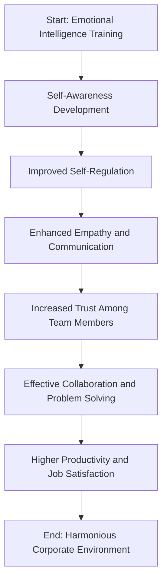

# How Emotional Intelligence Training Improved Team Collaboration in a Corporate Environment

### *A Self-Learning Article for the Balanced Life Subject*  
**Based on the NPTEL Course on Emotional Intelligence**

---

## Introduction

In the modern corporate landscape, *emotional intelligence (EI)* has emerged as a key factor that determines how effectively individuals work together, communicate, and resolve conflicts. Unlike traditional intelligence (IQ), which measures cognitive ability, emotional intelligence emphasizes **self-awareness, empathy, motivation, self-regulation, and social skills**. 

As organizations grow increasingly diverse and global, the ability to understand and manage emotions — both one’s own and those of others — becomes vital for creating a collaborative and psychologically safe workplace. This article explores how emotional intelligence training can improve **team collaboration**, enhance workplace harmony, and boost overall productivity, supported by insights gained from the NPTEL course on Emotional Intelligence.

---

## Understanding Emotional Intelligence

Emotional Intelligence (EI) refers to the ability to perceive, understand, and regulate emotions effectively. Psychologist Daniel Goleman popularized the concept, identifying five key components:

1. **Self-awareness** – Recognizing one’s own emotions and their effects.  
2. **Self-regulation** – Managing impulses and adapting to changing situations.  
3. **Motivation** – Maintaining enthusiasm and persistence toward goals.  
4. **Empathy** – Understanding others’ emotions and perspectives.  
5. **Social skills** – Building positive relationships and resolving conflicts.

These components are not innate; they can be **developed through training and practice**, making EI a crucial learnable skill for professional growth.

---

## The Corporate Context

In a corporate environment, employees frequently encounter situations involving deadlines, stress, and interpersonal dynamics. Lack of emotional intelligence often manifests as **miscommunication, low morale, and team conflicts**. 

For instance:
- A project manager who fails to recognize the burnout signs in their team may push them too hard, leading to resentment.  
- A technically skilled employee may struggle to work with others if they lack empathy or patience.  

Organizations that invest in **emotional intelligence training programs** often notice improved communication, better decision-making, and enhanced trust among team members.

---

## Implementation of Emotional Intelligence Training

Let’s consider a corporate case study from a mid-sized IT company. The organization faced challenges in teamwork — frequent disagreements, unclear communication, and low motivation levels.

The HR department introduced a **6-week Emotional Intelligence Training Program** that included:

- **Self-awareness sessions** using reflective journaling and feedback tools.  
- **Role-play exercises** to practice empathy and conflict resolution.  
- **Mindfulness workshops** to enhance focus and emotional regulation.  
- **Team-based problem-solving activities** encouraging cooperation.

Over time, employees reported **greater emotional control**, **improved listening skills**, and a **better sense of belonging**.

---

## Flowchart: Impact of EI Training on Team Collaboration

Below is a visual representation of how emotional intelligence training positively influences team collaboration.

## How EI Training Improved Collaboration

After the training, the company’s internal surveys revealed several key improvements:

* **Empathetic Communication:** Employees became more open to understanding others’ viewpoints, leading to fewer misunderstandings.
* **Conflict Management:** Teams started resolving conflicts constructively instead of avoiding or escalating them.
* **Trust Building:** A sense of mutual respect and psychological safety was established, making it easier to share ideas.
* **Motivation and Morale:** Recognition of emotional needs created a more inclusive and motivating workplace.
* **Leadership Transformation:** Managers learned to lead with compassion and authenticity rather than authority alone.

These outcomes reflect how emotional intelligence transforms the **team dynamic** — shifting focus from individual achievement to **collective success**.

---

## 🧩 Real-World Applications of Emotional Intelligence

1. **Remote Teams:** In hybrid and remote work setups, EI helps maintain connection and morale despite physical distance.
2. **Customer Relations:** Empathetic communication enhances client satisfaction and retention.
3. **Leadership Development:** EI is now considered a core competency in leadership programs worldwide.
4. **Change Management:** Emotionally intelligent leaders guide teams through organizational changes with resilience and optimism.

---

## Broader Importance in Personal and Professional Life

Beyond the corporate setting, emotional intelligence contributes significantly to **mental well-being** and **work-life balance**.
It enables individuals to manage stress, make balanced decisions, and maintain positive interpersonal relationships — aligning directly with the goals of a **balanced life**.

Developing EI not only enhances professional collaboration but also cultivates empathy and self-awareness in personal spaces, promoting overall harmony and fulfillment.

---

## Conclusion

Emotional intelligence is no longer an optional soft skill — it is an **essential pillar of sustainable teamwork and leadership**. The NPTEL course provided valuable insights into understanding emotional triggers, managing interpersonal dynamics, and applying empathy in daily interactions.

When emotional intelligence becomes part of a company’s culture, collaboration flourishes naturally. Employees feel valued, conflicts are handled gracefully, and productivity increases without compromising emotional well-being.

In essence, **emotional intelligence training bridges the gap between professional efficiency and human connection**, creating workplaces that are not only successful but also compassionate.

---

## References

1. Goleman, D. (1995). *Emotional Intelligence: Why It Can Matter More Than IQ.* Bantam Books.
2. NPTEL Course: *Emotional Intelligence*, by IIT Kharagpur.
3. Bradberry, T., & Greaves, J. (2009). *Emotional Intelligence 2.0.* TalentSmart.
4. Harvard Business Review. (2017). *The Business Case for Emotional Intelligence.*
5. Salovey, P., & Mayer, J.D. (1990). *Emotional Intelligence*, *Imagination, Cognition, and Personality.*

